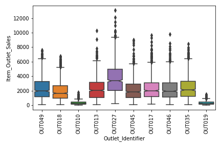

# Food Item Sales
## Analysis and modeling of food item sales

**Author**: Jackson Muehlbauer

### Business problem:

From both the perspective of a wholesale food supplier and a retail food seller, it is important to have an understanding of how well a particular item will sell. Having the ability to predict the amount of sales for a particular item will allow both of the interested parties to maximize profit and minimize risk. That said, there are many variables that have the potential to impact an item's total sales, such as the type of food, the size of the outlet it is being sold at, etc. Thus, scientific analysis and modeling is vital in improving the prediction capabilities for either the wholesale supplier and the retail seller. 

### Data:
The raw data contained 8523 entries and 12 columns. The column names and descriptions are displayed in dictionary below.
#### Data Dictionary:

## Methods
The data was prepped for analysis by checking for duplicated rows and missing entries for each feature. The unique values for the categorical features were checked for any inconsistencies, to which these were fixed using best judgement. For both the data exploration and machine learning portions of this exercise, missing values were imputed, although different methods were employed for each to prevent data leakage. After cleaning the data, the data was  explored and explained. 

### Exploratory Data Analysis
#### Numerical Features
- Plotted as a histogram to btter understand their distribution. 
- Plotted as a correlation heatmap to understand any correlations to other features and to the target
> The image below shows the distribution to the item's visibility. From this histogram, it was observed that this feature is very left-skewed and most items appear to have very little visibility. 

#### Categorical Features
- Plotted as multivariate boxplots with respect to the Item_Outlet_Sales. This gave some insight as to which features could be useful in our model. 
- Plotted as frequency bar plots. This gave some insight as to which categories were most common in each feature.
> The image below shows one of the multivariate boxplots with the variables of Outlet_Identifier and Item_Outlet_Sales. From this, it's clear that certain outlets have much larger item sales than others. 

### Explanatory Data Analysis
> The highest correlated feature to the item outlet sales was the item's maximum retail price as shown in the plot below 

## Results

## Model

Describe your final model

Report the most important metrics

Refer to the metrics to describe how well the model would solve the business problem

## Model Recommendations:

The recommended model is the decision regression tree over the linear regression.

Overall, the single decision regression tree performed slightly better than the linear regression in both R-squared and RMSE calculated from the test set.

The test set R-squared for the single decision tree was 0.5947 while the same metric for the linear regression model was 0.5685. The higher value for decision tree indicates that the model better can better explain the variance in the item outlet sales with the available features.

The test set RMSE for the decision tree was $1057.42, the same metric for the linear regression was $1091.05. These are very close in value but there is still a slight edge for the decision tree. Overall, the decision tree predicts with slightly lower residuals.

## Limitations & Next Steps

As stated previously, this single decision regression tree is far from perfect; the low R-squared values for both the train and test data shows that this model has high bias. The RMSE values also show that there is a large amount of error in this model, especially when compared to the average item outlet sales. 

The next steps in obtaining a better model would be to try a random forest model on the data. This should improve the performance metrics as this model bootstraps, aggregates, and randomizes the allowable features in the decision tree. From the correlation heat map, only one numeric term was even moderately correlated to the item outlet sales. By randomizing the available features, there could exist some additional predictive power from the other features.

To improve the model even further, additional features could be measured and recorded. In theory, having more (useful) information to describe the target should improve the predictive capability of the model. For example, "organic" could be added as a feature to describe if the item is organic or conventional. That said, there is no guarentee that additional features will improvement the model

### For further information

For any additional questions, please contact 
- Jackson Muehlbauer
- **jlmuehlbauer@gmail.com**
